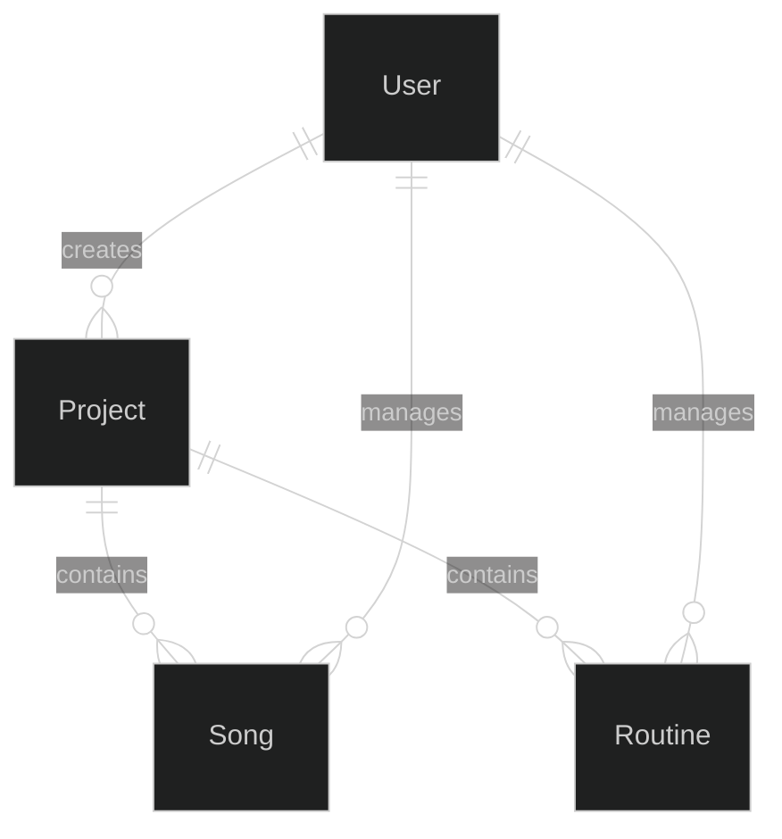
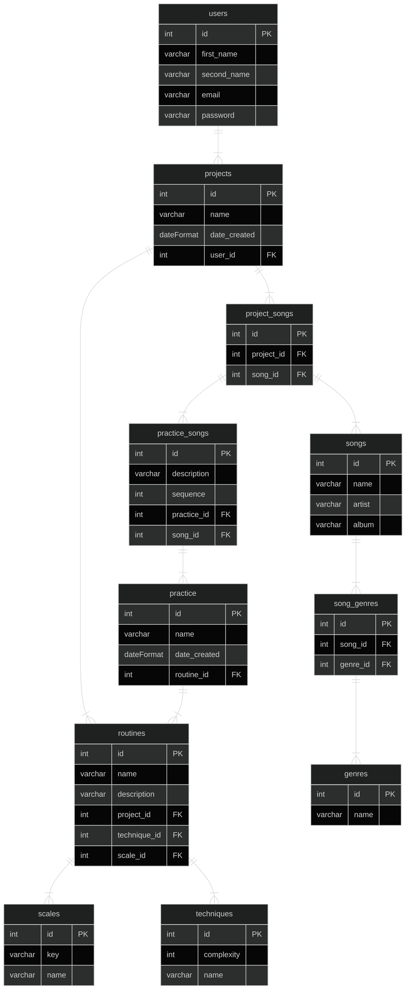

# Bass Technique and Scales Randomizer
SDET project for the Unosquare centre of excellence

## Problem definition:
It is necessary to create a simple web app that allows the user to create projects such as songs and practice routines and includes features like randomized scales and bass techniques so that practice time is more productive and covers more areas to improve bass playing. Other products are more complex and require signing up and paying subscriptions 


#### Must Have
- A user must be able to register an account.
- A user must be able to login.
- A user must be able to add, edit, delete and update projects, routines and songs.
- A user must be able to randomize scales.
- A user must be able to randomize bass techniques.

#### Should Have
- A user should be able to attach multimedia content (youtube video) to song projects.

#### Could Have
- Administrators can add, edit, delete and update non-administrator users.
- Practice reminders though slack integration.

#### Will not Have
- Notifications.
- A mobile interface.

## Domain Object Model:


## Entity Relationship Diagram:


## API Specification:

Base URL: https://localhost:8080/api/v1

Endpoints:

1. GET /users

* Description: Retrieve a list of all users.
* Response:
```
Status: 200 OK
[
  {
    "id": 1,
    "first_name": "John",
    "second_name": "Doe",
    "email": "johndoe@example.com",
  },
  {
    "id": 2,
    "first_name": "Jane",
    "second_name": "Doe",
    "email": "janedoe@example.com",
  }
]
```
2. GET /users/:id
* Description: Retrieve a single user by their id.
* Response:
```
Status: 200 OK
{
  "id": 1,
  "first_name": "John",
  "second_name": "Doe",
  "email": "johndoe@example.com",
  "projects": [
    {
        "id": 1,
        "name": "Project 1",
        "date_created": "2023-04-20",
        "routines": [
            {
                "id": 1,
                "name": "Routine 1",
                "description": "Fingering routine",
                "technique_id": 1
                "scale_id": 1
            }
        ]
    },
  ]
}
```
3. POST /users

* Description: Create a new user.
* Request:
```
{
  "first_name": "John",
  "second_name": "Doe",
  "email": "johndoe@example.com",
  "password": "********"
}
```
* Response:
```
Status: 201 Created
{
  "id": 3,
  "first_name": "John",
  "second_name": "Doe",
  "email": "johndoe@example.com",
}
```

4. PUT /users/:id

* Description: Update an existing user by their id.
* Request:
```
{
  "first_name": "Jane",
  "second_name": "Doe",
  "email": "janedoe@example.com",
  "password": "********"
}
```
* Response:
```
Status: 200 OK
{
  "id": 2,
  "first_name": "Jane",
  "second_name": "Doe",
  "email": "janedoe@example.com"
}
```

5. DELETE /users/:id
* Description: Delete an existing user by their id.
* Response:
```
Status: 204 No Content
```

6. GET /projects

* Description: Retrieve a list of all projects.
* Response:
```
Status: 200 OK
[
  {
    "id": 1,
    "name": "Project 1",
    "date_created": "2023-04-20",
    "user_id": 1
  },
  {
    "id": 2,
    "name": "Project 2",
    "date_created": "2023-04-21",
    "user_id": 2
  }
]
```

7. GET /projects/:id

* Description: Retrieve a single project by its id.
* Response:
```
Status: 200 OK
{
  "id": 1,
  "name": "Project A",
  "date_created": "2022-01-01T00:00:00Z",
  "user_id": 1
}
```

8. POST /projects

* Description: Create a new project
* Request:
```
{
  "name": "Project 1",
  "date_created": "2023-04-20",
  "user_id": 1
}
```
* Response:
```
Status: 201 Created
{
  "id": 3,
  "name": "Project 1",
  "date_created": "2023-04-20",
  "user_id": 1
}
```

9. PUT /projects/:id

* Description: Update an existing project by their id.
* Request:
```
{
  "id": 3,
  "name": "Project 1111",
  "user_id": 1
}
```
* Response:
```
Status: 200 OK
{
  "id": 3,
  "name": "Project 1111",
  "date_created": "2023-05-09T00:00:00.000Z",
  "user_id": 1
}
```

10. DELETE /projects/:id
* Description: Delete an existing project by their id.
* Response:
```
Status: 204 No Content
```

11. GET /routines

* Description: Retrieve a list of all routines.
* Response:
```
Status: 200 OK
{
  "id": 1,
  "name": "Routine 1",
  "description": "Fingering routine",
  "project_id": 1
  "technique_id": 1
  "scale_id": 1
}
```

12. PUT /routines/:id

* Description: Update an existing routine by their id.
* Response:
```
Status: 200 OK
{
  "id": 1,
  "name": "Routine 1",
  "description": "Fingering routine",
  "project_id": 1
  "technique_id": 1
  "scale_id": 1
}
```

13. GET /routines/:id

* Description: Retrieve a single routine by its id.
* Response:
```
Status: 200 OK
{
    "id": 1,
    "name": "Routine 2",
    "description": "Picking routine",
    "project_id": 2
    "technique_id": 2
    "scale_id": 1
}
```

14. POST /routines

* Description: Create a new routine
* Request:
```
{
    "id": 1,
    "name": "Routine 2",
    "description": "Picking routine",
    "project_id": 2,
    "technique_id": 2,
    "scale_id": 1,
    "user_id": 1
}
```
* Response:
```
Status: 201 Created
{
    "id": 1,
    "name": "Routine 2",
    "description": "Picking routine",
    "project_id": 2
    "technique_id": 2
    "scale_id": 1
}
```

15. DELETE /routines/:id
* Description: Delete an existing routine by their id.
* Response:
```
Status: 204 No Content
```

16. GET /songs

* Description: Retrieve a list of all songs
* Response:
```
Status: 200 OK
[
  {
    "id": 1,
    "name": "Song 1",
    "artist": "Artist 1",
    "album": "Album 1"
  },
  {
    "id": 2,
    "name": "Song 2",
    "artist": "Artist 2",
    "album": "Album 2"
  }
]
```

17. GET projects/:id/songs

* Description: Retrieve all songs for a project.
* Response:
```
Status: 200 OK
[
  {
    "id": 1,
    "name": "Song 1",
    "artist": "Artist 1",
    "album": "Album 1"
  },
  {
    "id": 2,
    "name": "Song 2",
    "artist": "Artist 2",
    "album": "Album 2"
  }
]
```

18. POST /songs

* Description: Create a new song
* Request:
```
{
  "name": "Song 1",
  "artist": "Artist 1",
  "album": "Album 1"
}
```
* Response:
```
Status: 201 Created
{
  "id": 3,
  "name": "Song 1",
  "artist": "Artist 1",
  "album": "Album 1"
}
```

19. GET /genres

* Description: Retrieve a list of all genres
* Response:
```
Status: 200 OK
[
  {
    "id": 1,
    "name": "Rock",
  },
  {
    "id": 2,
    "name": "Metal",
  }
]
```

20. GET /scales

* Description: Retrieve a list of all scales
* Response:
```
Status: 200 OK
[
  {
    "id": 1,
    "key": "C",
    "name": "C Major",
  },
  {
    "id": 2,
    "key": "D",
    "name": "D Major",
  }
]
```

21. GET /techniques

* Description: Retrieve a list of all techniques
* Response:
```
Status: 200 OK
[
  {
    "id": 1,
    "complexity": "Beginner",
    "name": "Fingering",
  },
  {
    "id": 2,
    "complexity": "Beginner",
    "name": "Picking",
  }
]
```