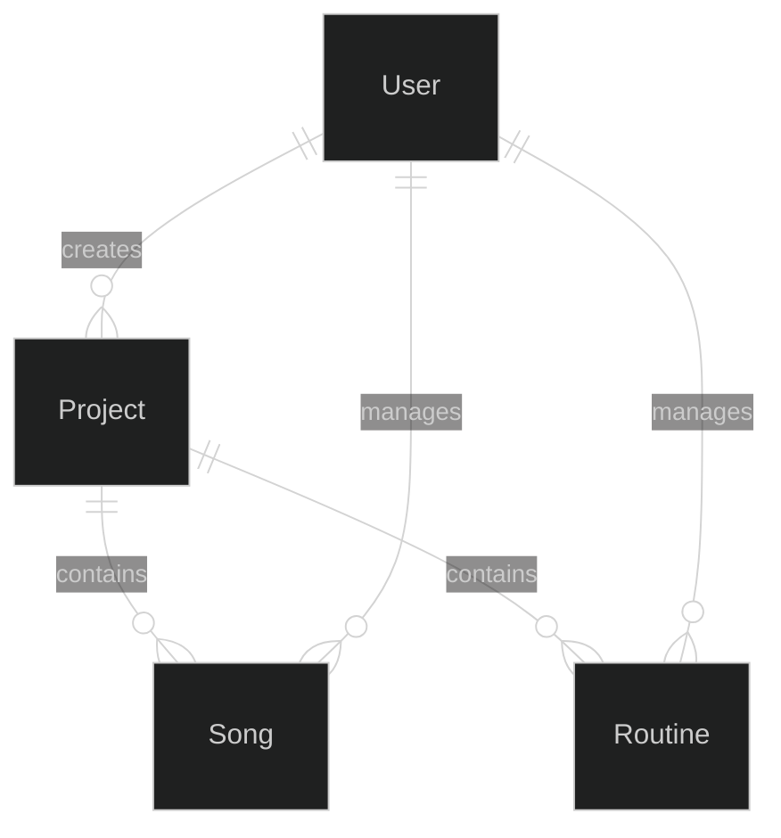
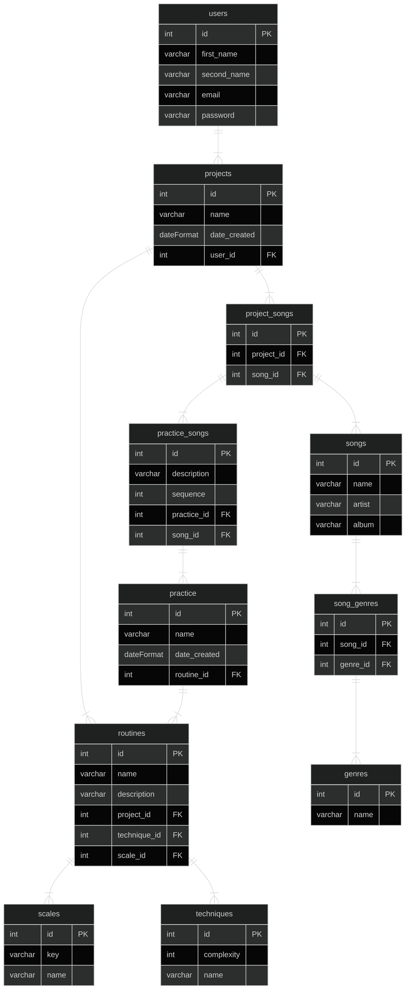

# Bass Technique and Scales Randomizer
SDET project for the Unosquare centre of excellence

## Problem definition:
It is necessary to create a simple web app that allows the user to create projects such as songs and practice routines and includes features like randomized scales and bass techniques so that practice time is more productive and covers more areas to improve bass playing. Other products are more complex and require signing up and paying subscriptions 

#### Must Have
- A user must be able to register an account.
- A user must be able to login.
- A user must be able to add, edit, delete and update projects, routines and songs.
- A user must be able to randomize scales.
- A user must be able to randomize bass techniques.

#### Should Have
- A user should be able to attach multimedia content (youtube video) to song projects.

#### Could Have
- Administrators can add, edit, delete and update non-administrator users.
- Practice reminders though slack integration.

#### Will not Have
- Notifications.
- A mobile interface.

## Domain Object Model:

## Entity Relationship Diagram:
